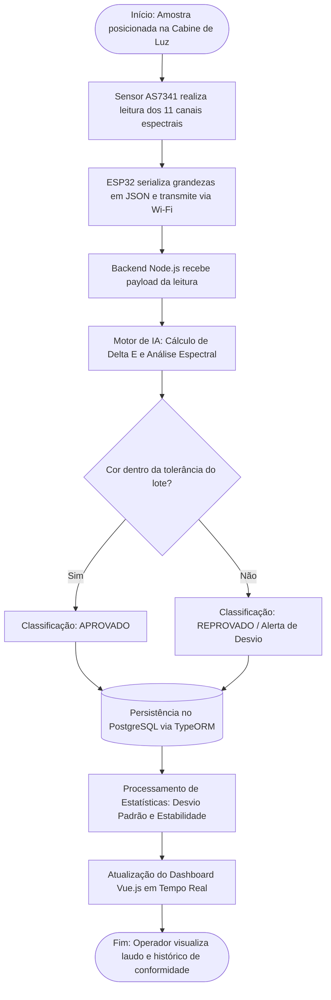
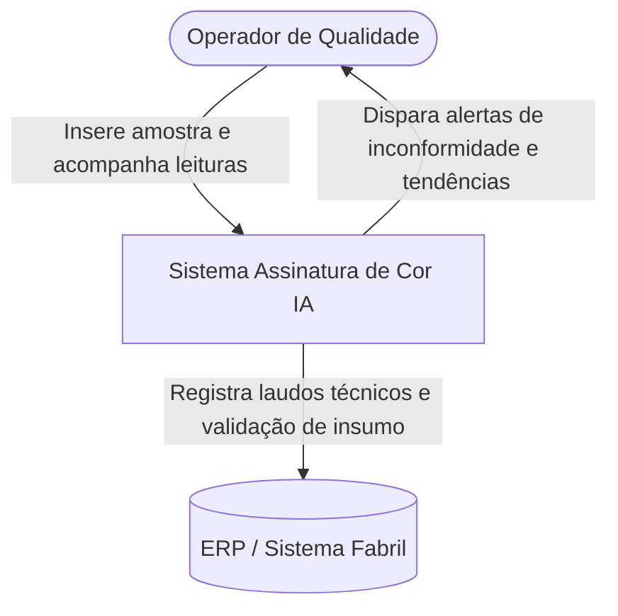
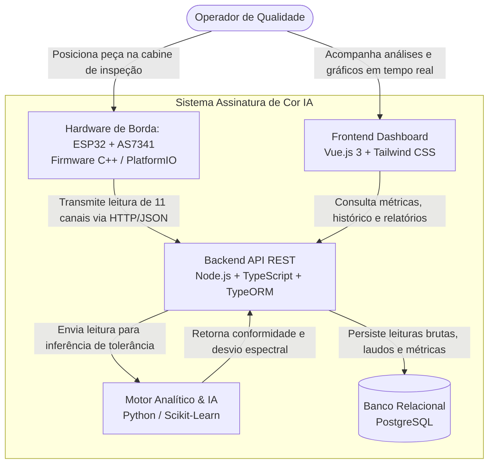
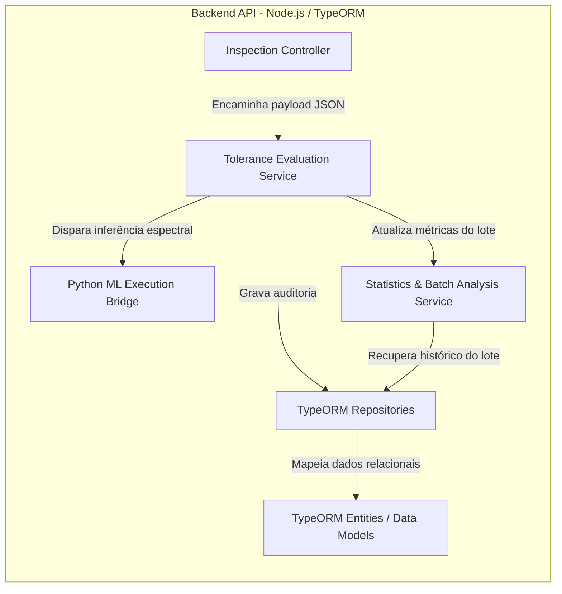

# Assinatura de Cor IA 🎯

Sistema de espectrometria industrial e inteligência artificial aplicado ao controle de qualidade de materiais. O projeto substitui o julgamento visual subjetivo por assinaturas espectrais quantitativas, monitorando desvios de tonalidade, metamerismo e estabilidade de lotes em tempo real.

---

## 📊 Fluxo Operacional de Inspeção

O fluxograma abaixo apresenta o processo operacional desde o posicionamento da amostra até a persistência dos dados e a geração de indicadores estatísticos:



---

## 🏗️ Arquitetura do Sistema (Modelo C4)

### Nível 1: Diagrama de Contexto (System Context)

Fronteiras operacionais do sistema com usuários e sistemas corporativos.



---

### Nível 2: Diagrama de Contêineres (Containers)

Estrutura dos serviços, banco de dados e aplicações do ecossistema.



---

### Nível 3: Diagrama de Componentes (Backend API)

Organização interna dos módulos do serviço de aplicação.



---

## 📦 Lista de Materiais de Eletrônica (BOM)

A montagem aproveita a **cabine física e iluminação industrial já existentes**, demandando apenas os módulos de sensoriamento e controle:

| Componente              | Especificação Técnica                         | Função no Projeto                                             |
| :---------------------- | :-------------------------------------------- | :------------------------------------------------------------ |
| **Microcontrolador**    | ESP32 DevKit NodeMCU (USB-C, 30/38 pinos)     | Aquisição I2C, conversão JSON e envio via rede Wi-Fi          |
| **Sensor Espectral**    | AMS OSRAM AS7341 (Breakout STEMMA QT / Qwiic) | Espectrometria óptica de 11 canais (visível e NIR)            |
| **Cabo de Conexão**     | Cabo JST-SH 4 pinos para jumpers macho        | Interligação direta entre sensor e microcontrolador sem solda |
| **Fonte / Alimentação** | Fonte USB 5V 2A DC com cabo USB-C             | Alimentação elétrica dedicada para o microcontrolador         |

---

## 🔌 Pinagem e Interface Elétrica (I2C)

A comunicação física opera em nível lógico nativo de 3.3V:

| Pino AS7341 (STEMMA QT) | Pino ESP32 (GPIO) | Descrição do Sinal        | Nível Lógico |
| :---------------------- | :---------------- | :------------------------ | :----------- |
| **VIN / VCC**           | **3V3**           | Tensão de alimentação     | 3.3V DC      |
| **GND**                 | **GND**           | Referência de terra comum | 0V           |
| **SDA**                 | **GPIO 21 (D21)** | Linha serial de dados I2C | 3.3V         |
| **SCL**                 | **GPIO 22 (D22)** | Linha serial de clock I2C | 3.3V         |

---

## 💻 Stack Tecnológica

- **Hardware e Firmware:** ESP32 NodeMCU, Sensor AS7341, C++ / FreeRTOS via PlatformIO.
- **Backend:** Node.js, TypeScript, Express, TypeORM.
- **Motor Analítico & IA:** Python (NumPy, Scikit-Learn para modelos de tolerância dinâmica e cálculo de $\Delta E$).
- **Banco de Dados:** PostgreSQL (registro de leituras espectrais brutas, laudos e lotes).
- **Frontend:** Vue.js 3 (Composition API), Tailwind CSS (painel operacional, gráficos de dispersão e controle estatístico de processo).

---

## 📂 Estrutura de Diretórios (Monorepo)

```text
assinatura-cor-ia/
├── docs/                     # Diagramas C4, esquemáticos e manuais de calibração
├── firmware/                 # Código-fonte C++ do ESP32 (PlatformIO)
├── backend/                  # API REST Node.js com TypeScript e TypeORM
│   └── src/
│       ├── controllers/      # Controladores de rotas HTTP
│       ├── database/         # Configurações de conexão e migrations
│       ├── entities/         # Modelos de dados (Leitura, Inspecao, Lote)
│       └── services/         # Regras de negócio, estatística e integração
├── ml-service/               # Scripts Python de inferência espectral e tolerância
├── frontend/                 # Interface Web Vue.js 3 com painel em tempo real
└── README.md                 # Documentação unificada do projeto
```
