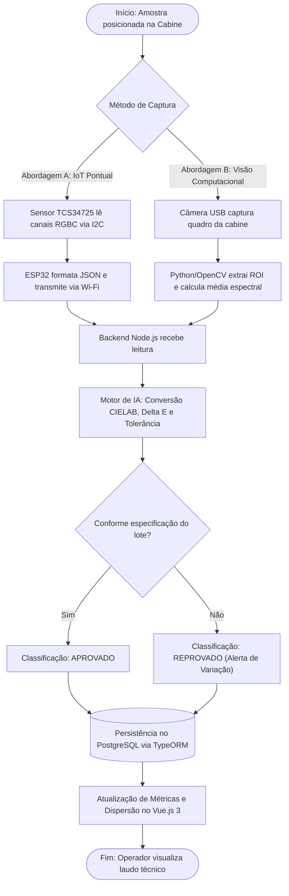
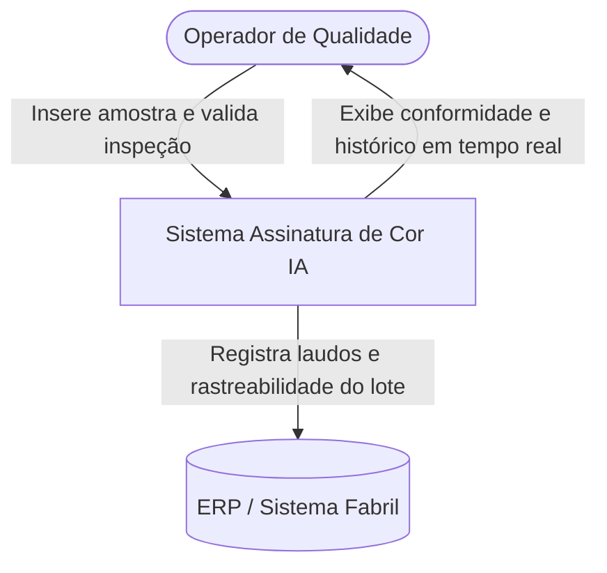
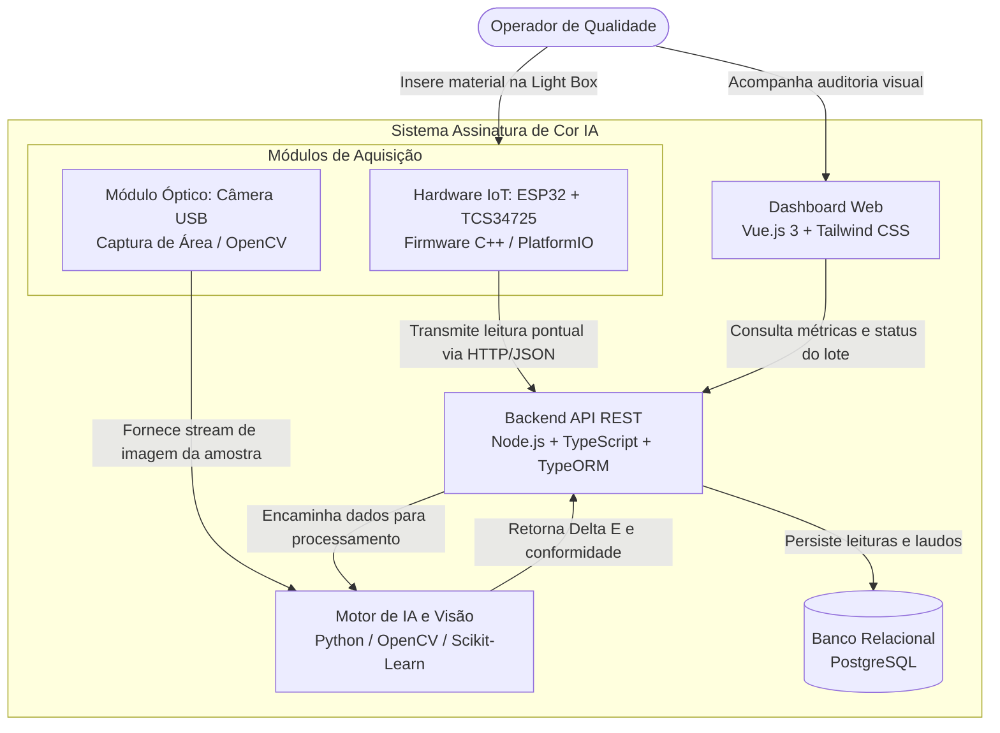
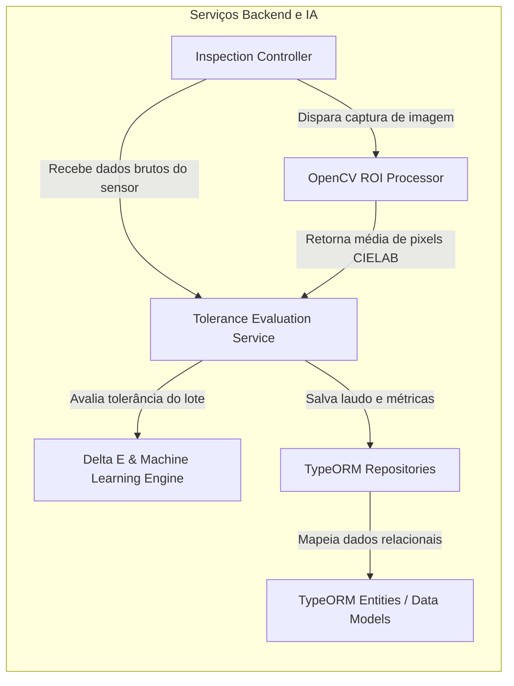

# Assinatura de Cor IA 🎯

Sistema híbrido de sensoriamento óptico, visão computacional e inteligência artificial aplicado ao controle de qualidade de materiais industriais (tecidos, laminados sintéticos, malhas e EVA). O projeto avalia duas abordagens de captura para mitigar interferências de textura e metamerismo: medição digital pontual e inspeção espacial por área.

---

## 📊 Fluxo Operacional de Inspeção

Processo operacional contemplando as duas rotas de aquisição na cabine antes da análise de conformidade:



---

## 🏗️ Arquitetura do Sistema (Modelo C4)

### Nível 1: Diagrama de Contexto (System Context)

Fronteiras operacionais do sistema com usuários e sistemas corporativos.



---

### Nível 2: Diagrama de Contêineres (Containers)

Topologia dos módulos de aquisição, processamento e visualização.



---

### Nível 3: Diagrama de Componentes (Backend & IA)

Estrutura interna dos controladores, serviços analíticos e repositórios.



---

## 📦 Lista de Materiais para Testes (BOM)

A montagem aproveita a **cabine física e iluminação industrial já existentes na fábrica**:

| Componente           | Especificação Técnica                         | Abordagem           | Função no Projeto                               |
| :------------------- | :-------------------------------------------- | :------------------ | :---------------------------------------------- |
| **Sensor de Cor**    | Módulo Digital TCS34725 (Filtro IR integrado) | Abordagem A (IoT)   | Medição digital direta RGBC via I2C             |
| **Microcontrolador** | ESP32 DevKit V1 (NodeMCU, 30/38 pinos)        | Abordagem A (IoT)   | Coleta de dados do sensor e envio Wi-Fi         |
| **Conexões**         | Jumpers Dupont Fêmea-Fêmea (20 cm)            | Abordagem A (IoT)   | Ligação direta sem solda entre placa e sensor   |
| **Câmera USB**       | Câmera Full HD com ajuste manual de exposição | Abordagem B (Visão) | Captura de área ampla para atenuação de textura |
| **Difusor Óptico**   | Acrílico translúcido leitoso (opcional)       | Abordagem A (IoT)   | Dispersão física de micro-sombras do tecido     |
| **Estrutura / Luz**  | Cabine fechada com luz calibrada              | Ambas               | **R$ 0,00 (Recurso existente)**                 |

---

## 🔌 Pinagem e Interface Elétrica (TCS34725 ao ESP32)

Ligação em nível lógico nativo de 3.3V sem necessidade de conversores de nível:

| Pino TCS34725 | Pino ESP32 (GPIO)     | Descrição do Sinal                | Nível Lógico |
| :------------ | :-------------------- | :-------------------------------- | :----------- |
| **VIN / VCC** | **3V3**               | Alimentação positiva do módulo    | 3.3V DC      |
| **GND**       | **GND**               | Referência de terra comum         | 0V           |
| **SDA**       | **GPIO 21 (D21)**     | Linha serial de dados I2C         | 3.3V         |
| **SCL**       | **GPIO 22 (D22)**     | Linha serial de clock I2C         | 3.3V         |
| **LED**       | _Não conectado / GND_ | Controle do LED auxiliar da placa | —            |

---

## 💻 Stack Tecnológica

- **Firmware IoT:** C++, FreeRTOS, PlatformIO (VS Code).
- **Visão Computacional & IA:** Python (OpenCV para processamento de matrizes de imagem; NumPy e Scikit-Learn para conversão CIELAB, $\Delta E$ e modelos de tolerância).
- **Backend:** Node.js, TypeScript, Express, TypeORM.
- **Banco de Dados:** PostgreSQL (histórico de inspeções, leituras pontuais, médias de área e laudos de qualidade).
- **Frontend:** Vue.js 3 (Composition API), Vite, Tailwind CSS (painel operacional com controle estatístico e dispersão em tempo real).

---

## 📂 Estrutura de Diretórios (Monorepo)

```text
assinatura-cor-ia/
├── docs/                     # Diagramas C4, esquemáticos e manuais
├── firmware/                 # Firmware C++ para ESP32 + TCS34725 (PlatformIO)
├── vision-service/           # Serviço Python (OpenCV ROI, CIELAB e modelos de IA)
├── backend/                  # API REST Node.js com TypeScript e TypeORM
│   └── src/
│       ├── controllers/      # Handlers de rotas de inspeção
│       ├── database/         # Data Source e Migrations do TypeORM
│       ├── entities/         # Modelos (Inspecao, Lote, ParametroCor)
│       └── services/         # Regras de negócio e avaliação estatística
├── frontend/                 # Interface Web Vue.js 3 + Tailwind CSS
└── README.md                 # Documentação técnica unificada
```
