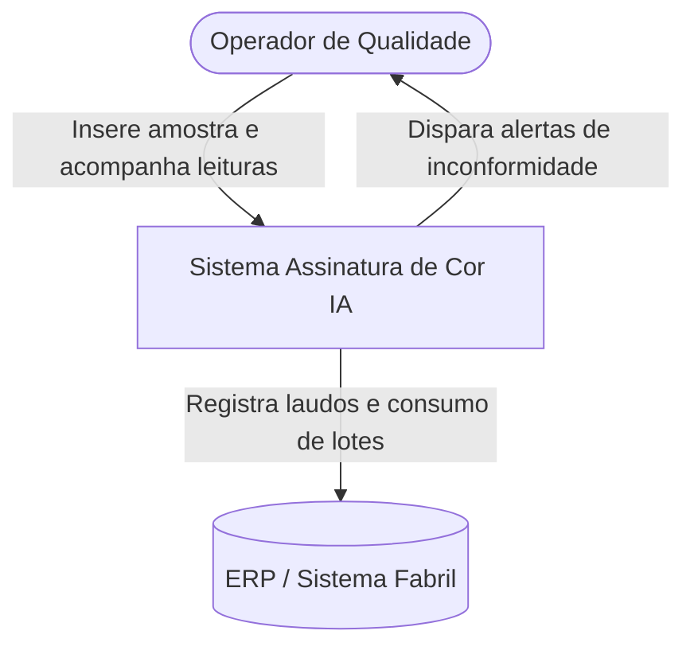
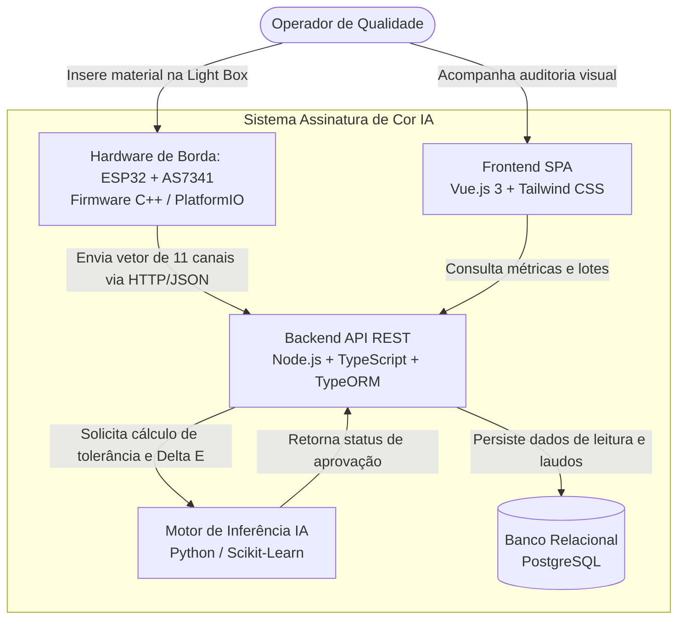
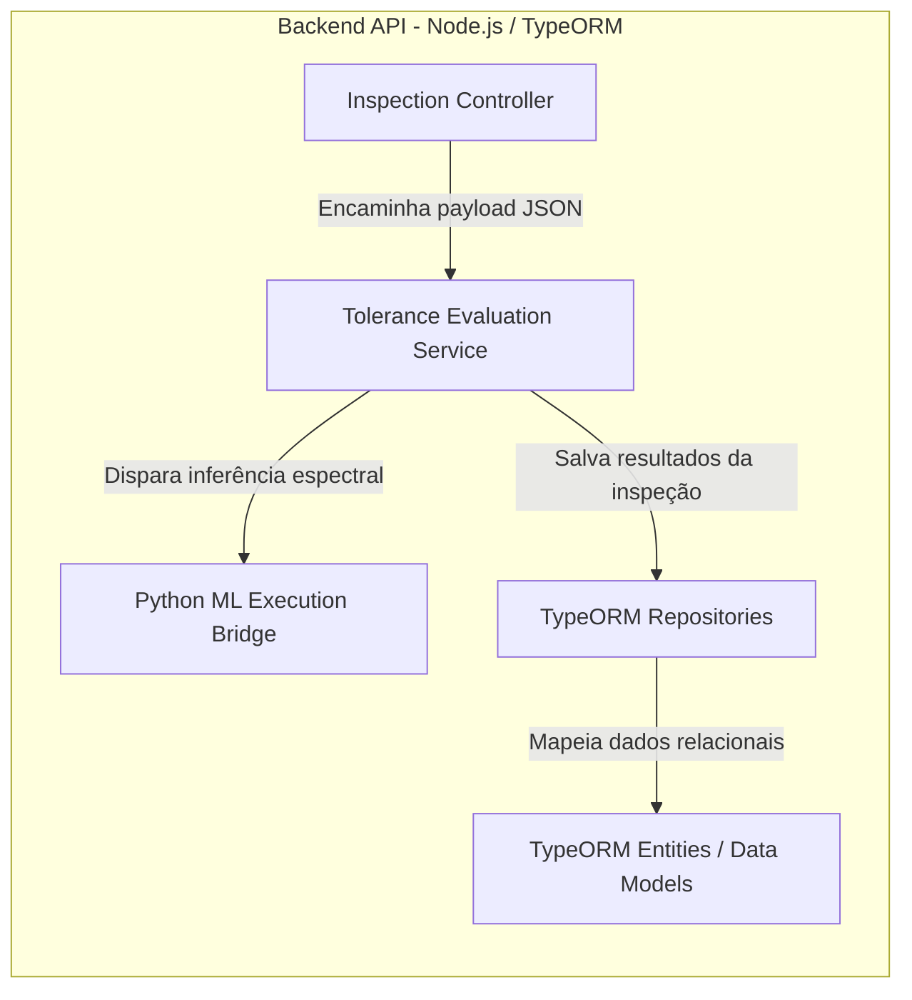

# Assinatura de Cor IA 🎯

Sistema de visão espectral e computação de borda desenvolvido para controle de qualidade e validação de tolerância de cor em insumos industriais (tecidos, laminados, malhas e EVA), mitigando falhas por metamerismo e textura.

---

## 🏗️ Arquitetura do Sistema (Modelo C4)

### Nível 1: Diagrama de Contexto (System Context)

Apresenta o sistema e suas fronteiras de comunicação com os usuários e sistemas fabris.



---

### Nível 2: Diagrama de Contêineres (Containers)

Detalha os blocos de software/hardware executáveis e a comunicação entre eles.



---

### Nível 3: Diagrama de Componentes (Backend API)

Detalhamento interno do contêiner da API Node.js para entendimento dos módulos de serviço.



---

## ⚙️ Fluxo Operacional de Inspeção

```text
[Amostra na Cabine] ➔ [Leitura Espectral (11 Canais)] ➔ [Disparo HTTP/JSON] ➔ [Análise de Tolerância IA] ➔ [Persistência TypeORM] ➔ [Dashboard Vue.js]
```

1. **Amostragem Estática:** O material é inserido na cabine fechada (_Light Box_) sob iluminação controlada (LEDs 6500K).
2. **Varredura Espectral:** O sensor multicanal AS7341 decompõe a luz refletida em 8 comprimentos de onda do espectro visível (415nm a 680nm), além dos canais NIR e Clear.
3. **Comunicação de Borda:** O ESP32 serializa as grandezas em formato JSON e dispara uma requisição `POST /api/v1/inspecoes` via rede local Wi-Fi.
4. **Decisão Inteligente:** O backend submete a assinatura espectral ao modelo de tolerância treinado em Python ($\Delta E$ e limites de variabilidade), classificando a peça como **Aprovada** ou **Reprovada**.
5. **Auditoria e Interface:** Os dados são persistidos no PostgreSQL através do TypeORM e atualizam o painel de monitoramento do operador em tempo real.

---

## 📦 Lista de Materiais e Especificações (BOM)

| Componente           | Especificação Técnica                                | Função no Projeto                                    |
| :------------------- | :--------------------------------------------------- | :--------------------------------------------------- |
| **Microcontrolador** | ESP32 DevKit NodeMCU (USB-C, 30/38 pinos)            | Aquisição I2C, empacotamento JSON e envio Wi-Fi      |
| **Sensor Espectral** | AMS OSRAM AS7341 (Breakout STEMMA QT / Qwiic)        | Espectrometria óptica multicanal (11 bandas)         |
| **Cabeamento**       | Cabo JST-SH 4 pinos para jumpers macho               | Conexão rápida sem necessidade de solda (I2C)        |
| **Câmara Óptica**    | Cabine fechada (Light Box) revestida em branco fosco | Isolamento contra interferências de luz ambiente     |
| **Iluminação**       | Fita LED neutra/fria (5000K a 6500K)                 | Fonte lumínica uniforme para reflexão                |
| **Difusor**          | Placa de acrílico translúcido leitoso fino           | Dispersão ótica para atenuação de relevos e ranhuras |

---

## 🔌 Pinagem e Interface Elétrica (I2C)

A comunicação entre a placa de controle e o módulo opera em nível lógico nativo de 3.3V:

| Pino AS7341 (STEMMA QT) | Pino ESP32 (GPIO) | Descrição do Sinal              | Nível Lógico |
| :---------------------- | :---------------- | :------------------------------ | :----------- |
| **VIN / VCC**           | **3V3**           | Alimentação do circuito         | 3.3V DC      |
| **GND**                 | **GND**           | Referência comum de aterramento | 0V           |
| **SDA**                 | **GPIO 21 (D21)** | Linha serial de dados I2C       | 3.3V         |
| **SCL**                 | **GPIO 22 (D22)** | Linha serial de clock I2C       | 3.3V         |

---

## 💻 Stack Tecnológica

- **Hardware de Borda:** ESP32 NodeMCU, Sensor AS7341 (STEMMA QT)
- **Firmware:** C++, FreeRTOS, PlatformIO (VS Code)
- **Backend:** Node.js, TypeScript, Express, TypeORM
- **Serviço de Inferência IA:** Python (Scikit-Learn, NumPy, Pandas)
- **Banco de Dados:** PostgreSQL
- **Frontend:** Vue.js 3 (Composition API), Vite, Tailwind CSS

---

## 📂 Estrutura de Diretórios (Monorepo)

```text
assinatura-cor-ia/
├── docs/                     # Diagramas C4, esquemáticos e manuais de calibração
├── firmware/                 # Firmware do ESP32 via PlatformIO (C++)
├── backend/                  # API REST Node.js com TypeScript
│   └── src/
│       ├── controllers/      # Handlers das rotas HTTP
│       ├── database/         # Data Source e Migrations do TypeORM
│       ├── entities/         # Entidades ORM (Lotes, Leituras, Laudos)
│       └── services/         # Regras de negócio e integração com Python
├── ml-service/               # Scripts Python de inferência espectral e tolerância
├── frontend/                 # Interface Web Vue.js 3 + Tailwind CSS
└── README.md                 # Documentação unificada do repositório
```
